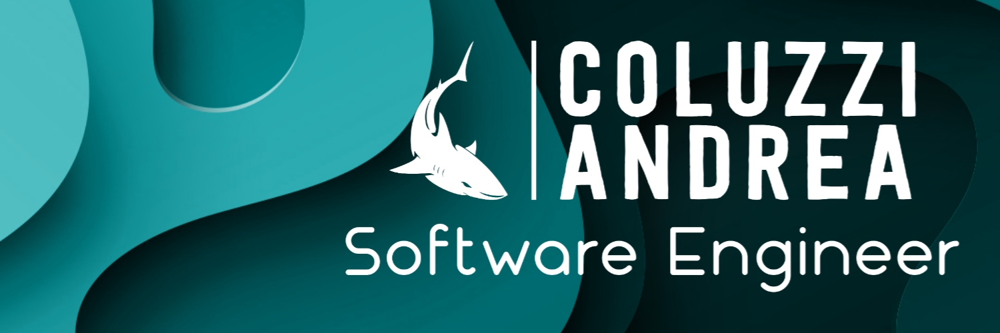

  

    

      👩‍💻 I'm Andrea, a Passionate Full Stack Software Engineer from  <b>Italy</b> 
    

    

    💼 Building the best Gift Cards experience in <a href="https://www.klarna.com/" target="_blank">Klarna</a> since Feb 2023
    

    

    🔥 In Jan 2023 I founded <a href="https://latina-in-tech.github.io/" target="_blank">Latina In Tech</a>, a local tech community based in Latina, Italy.   We organize monthly tech events on various topics
    

     
    

      <a href="https://skillicons.dev">
        
         
        
         
        
      </a>
    

  

  

      
  

 

  

📈 &nbsp;<b>My Github Stats</b>

  

 

## 🌎 &nbsp;Follow me on

  
   
           
  
  
    
 

